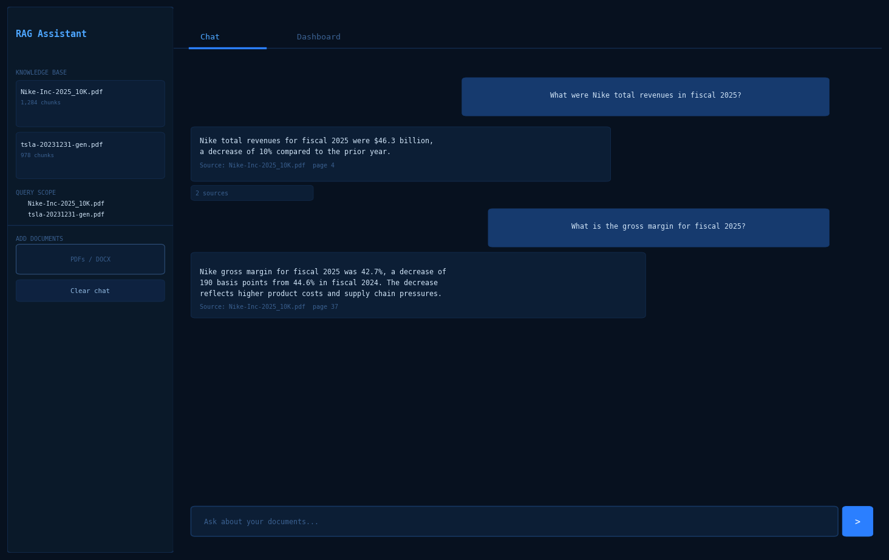

# Advanced RAG System

[](https://github.com/PetrSemiguk/RAG/actions)
[](https://python.org)
[](https://docs.llamaindex.ai)
[](https://qdrant.tech)
[](https://streamlit.io)
[](LICENSE)

A production-grade Retrieval-Augmented Generation pipeline built with LlamaIndex, Qdrant, and Streamlit. The system retrieves relevant context from PDF documents using hybrid dense + sparse search and synthesises answers with a local or cloud LLM.

---

## Demo

| Chat Interface | Analytics Dashboard |
|---|---|
|  |  |

> Run `streamlit run app.py` → open `http://localhost:8501` to generate screenshots.

---

## Architecture

```
┌─────────────────────────────────────────────────────────────────┐
│                       Streamlit UI (app.py)                     │
└───────────────────────────┬─────────────────────────────────────┘
                            │ query(question, history)
                            ▼
┌─────────────────────────────────────────────────────────────────┐
│                    RAGQueryEngine (src/engine.py)               │
│                                                                 │
│  ┌──────────────────────────────────────────────────────────┐   │
│  │              Retrieval (Strategy Pattern)                │   │
│  │                                                          │   │
│  │  HybridSearchStrategy          VectorOnlyStrategy        │   │
│  │  ├── VectorIndexRetriever      └── VectorIndexRetriever  │   │
│  │  │   (Qdrant, cosine, top-k)       (Qdrant, cosine)      │   │
│  │  └── BM25Retriever                                       │   │
│  │      (keyword, in-memory)                                │   │
│  │          └── QueryFusionRetriever (RRF fusion)           │   │
│  └─────────────────────────┬────────────────────────────────┘   │
│                            │ ranked nodes                       │
│  ┌─────────────────────────▼────────────────────────────────┐   │
│  │              Post-processors                             │   │
│  │  SimilarityPostprocessor (≥0.6, vector-only)             │   │
│  │  AdaptiveContextManager  (token-count guard, ≤2048)      │   │
│  │  CohereRerank            (optional, paid API)            │   │
│  └─────────────────────────┬────────────────────────────────┘   │
│                            │ top-N nodes                        │
│  ┌─────────────────────────▼────────────────────────────────┐   │
│  │              Response Synthesis                          │   │
│  │  RetrieverQueryEngine + compact mode                     │   │
│  │  Custom system prompt (context-only answers)             │   │
│  │  LLM: LM Studio (local) or OpenAI (cloud)                │   │
│  └──────────────────────────────────────────────────────────┘   │
│                                                                 │
│  QueryLogger → SQLite (logs/queries.db)                         │
└─────────────────────────────────────────────────────────────────┘

┌─────────────────────────────────────────────────────────────────┐
│                  Ingestion Pipeline (src/ingestor.py)           │
│                                                                 │
│  PDF files (data/)                                              │
│      └── pypdf (per-page text extraction, per-file errors)      │
│              └── Chunking Strategy                              │
│                  ├── SentenceSplitter  (strategy: "sentence")   │
│                  └── TokenTextSplitter (strategy: "fixed")      │
│                          └── HuggingFace Embeddings             │
│                              (BAAI/bge-base-en-v1.5, GPU-aware) │
│                                  └── Qdrant VectorStore (db/)   │
└─────────────────────────────────────────────────────────────────┘

┌─────────────────────────────────────────────────────────────────┐
│                  Evaluation Suite (evaluate.py)                 │
│                                                                 │
│  test_questions.json                                            │
│      ├── Retrieval Benchmark  → Hit Rate@k, MRR, NDCG@k        │
│      └── RAGAS-style Eval     → Relevancy, Faithfulness,        │
│                                 Context Precision/Recall        │
│                                                                 │
│  ExperimentTracker → results/experiments.jsonl                  │
│  Dashboard (app.py) → in-app evaluation with live progress      │
└─────────────────────────────────────────────────────────────────┘
```

---

## Why RAG?

Large language models hallucinate on domain-specific or recent knowledge they were not trained on. RAG solves this by:

1. **Indexing** your documents as vector embeddings in a local database.
2. **Retrieving** the most relevant chunks at query time.
3. **Constraining** the LLM to answer only from those chunks.

This gives accurate, source-cited answers without fine-tuning and without sending proprietary data to a cloud API (when using LM Studio locally).

---

## Key Design Decisions

| Decision | Choice | Justification |
|---|---|---|
| Embedding model | `BAAI/bge-base-en-v1.5` (768-dim) | Strong retrieval quality; runs on CPU in <1 s/chunk, GPU-accelerated on CUDA. |
| Vector DB | Qdrant (local file mode) | Zero-ops setup, HNSW indexing, metadata filtering. |
| Chunking | SentenceSplitter (512 chars, 50 overlap) | Sentence boundaries preserve coherent context. |
| Hybrid search | BM25 + Vector (RRF fusion) | BM25 catches exact-match keywords that embeddings miss. |
| LLM interface | OpenAI-compatible API | Works with LM Studio (local), OpenAI, or any compatible server. |
| Reranking | Cross-encoder / Cohere (opt-in) | Improves precision on final top-N; disabled by default. |

---

## Evaluation Results

Tested on two real-world financial 10-K filings:
- **Nike 10-K 2025** (`Nike-Inc-2025_10K.pdf`)
- **Tesla 10-K 2023** (`tsla-20231231-gen.pdf`)

### RAGAS Metrics — Nike 10-K (10 questions, hybrid search, k=10)

| Metric | Score | Interpretation |
|---|---|---|
| Hit Rate@10 | **1.00** | Correct chunk found in top-10 for all 10 questions |
| MRR | **0.93** | Correct chunk ranked #1 in the majority of cases |
| NDCG@10 | **0.93** | Strong ranking quality across all positions |
| Faithfulness | **0.56** | Answers grounded in context; room to improve with better reranking |

### Manual Q&A Accuracy — Nike 10-K 2025 (single-document mode)

**8 / 12 correct (67%)**

| Question | Result |
|---|---|
| Total revenues ($46.3B) | ✅ |
| US revenue percentage (43%) | ✅ |
| NIKE Direct decline ($2.7B) | ✅ |
| Gross margin (42.7%, -190bps) | ✅ |
| Apparel countries (Vietnam/China/Cambodia) | ✅ |
| Apparel factories (303 factories, 34 countries) | ✅ |
| Headquarters (Beaverton, Oregon) | ✅ |
| NIKE Direct decline details | ✅ |
| Employee count (77,800) | ❌ |
| Footwear countries (Vietnam/Indonesia/China) | ❌ |
| Operating overhead details | ❌ |
| Fiscal 2026 gross margin outlook | ❌ |

### Manual Q&A Accuracy — Tesla 10-K 2023 (single-document mode)

**5 / 12 correct (42%)**

| Question | Result |
|---|---|
| Total revenues ($96.77B) | ✅ |
| Net income ($15.00B) | ✅ |
| Cash & investments ($29.09B) | ✅ |
| Revenue increase ($15.31B) | ✅ |
| Operating cash flow ($13.26B) | ✅ |
| Employee count (140,473) | ❌ |
| Headquarters (Austin, Texas) | ❌ |
| Ticker symbol (TSLA, Nasdaq) | ❌ |
| Automotive gross margin (18.2%) | ❌ |
| Capital expenditure ($8.90B) | ❌ |
| Gigafactory countries | ❌ |
| New Gigafactory location (Mexico) | ❌ |

### Multi-Document Mode (Nike + Tesla simultaneously)

**3 / 10 correct (30%)**

- System correctly routes Nike questions to Nike document.
- Tesla questions occasionally retrieve Nike chunks instead.
- Financial summary facts work well across both documents.

### Analysis

Financial metrics embedded in prose (revenue totals, margins, cash flows) are retrieved reliably because they appear repeatedly in summary sections. HR and operational facts (employee counts, headquarters, ticker symbols) score lower because they are often found in short, isolated sentences that rank below denser financial paragraphs in semantic search. Table-heavy pages present a similar challenge — financial tables are split across chunk boundaries, diluting their signal.

---

## Known Limitations

**1. HR and operational facts retrieved less reliably than financial metrics**

Employee counts, headquarters addresses, and ticker symbols score lower in semantic search. Financial tables and prose summaries dominate the embedding space because they repeat key figures across multiple sections.

**2. Multi-document search without explicit routing**

When multiple documents are loaded simultaneously, queries about one company may retrieve chunks from another company's document. Best results are achieved when the user selects a specific document in the sidebar scope filter.

**3. Table-heavy pages score lower in semantic search**

Chunks containing financial tables are harder to retrieve because table content is split across chunk boundaries. Table-aware chunking would preserve tabular context as single units.

**4. Local LLM limitations**

Tested with `meta-llama-3.1-8b-instruct` (4096 context). Context overflow occurs on complex multi-part questions. GPT-4o-mini produces noticeably higher quality answers on the same retrieved context.

---

## Planned Improvements

| Priority | Improvement | Expected Impact |
|---|---|---|
| High | **Document Router** — detect which document is relevant before retrieval when multiple documents are loaded | Fixes multi-document cross-contamination |
| High | **Table-Aware Chunking** — detect and preserve financial tables as single chunks | Improves retrieval of tabular facts |
| Medium | **Larger Embedding Model** — upgrade from `bge-base-en-v1.5` (768-dim) to `bge-large-en-v1.5` (1024-dim) | Better semantic matching on operational facts |
| Medium | **Cross-Encoder Reranking tuning** — already implemented, needs threshold calibration for operational questions | Higher precision on HR/operational facts |
| Low | **Extended Evaluation Pipeline** — expand RAGAS evaluation to cover both financial and operational question types systematically | More reliable benchmark signal |

---

## Setup

### Prerequisites
- Python 3.10+
- [LM Studio](https://lmstudio.ai) running at `http://localhost:1234/v1` with any model loaded (for answer generation)
- PDF files placed in `data/`
- Optional: `COHERE_API_KEY` env var to enable reranking

### Install

```bash
python -m venv .venv
# Windows
.venv\Scripts\activate
# macOS / Linux
source .venv/bin/activate

pip install -r requirements.txt
```

### Ingest Documents

```bash
# First run — build index from scratch
python src/ingestor.py --data-dir data --db-path db --recreate

# Subsequent runs — add new PDFs incrementally
python src/ingestor.py --data-dir data --db-path db
```

### Run the App

```bash
streamlit run app.py
# Opens at http://localhost:8501
```

---

## How to Run Evaluation

The app ships with a built-in RAGAS evaluation dashboard. No separate script is needed.

### In-app evaluation (recommended)

1. Start the app: `streamlit run app.py`
2. Open the **Dashboard** tab → **evaluation** sub-tab.
3. Ensure `data/test_questions.json` exists (or click **Generate from documents** to auto-generate questions with the LLM).
4. Tick **+RAGAS** to include answer-quality metrics (requires LM Studio running with a model loaded).
5. Click **▶ Run** — progress is shown live and results are saved to `results/experiments.jsonl`.

The dashboard displays:
- **Hit Rate@K**, **MRR**, **NDCG@K** — retrieval quality metrics
- **Faithfulness**, **Answer Relevancy**, **Context Precision**, **Context Recall** — answer quality (RAGAS, when enabled)
- Per-question breakdown showing which questions hit or missed
- **Compare** tab for side-by-side metric bars across multiple runs

### CLI evaluation

```bash
# Retrieval metrics only (no LLM needed)
python evaluate.py --retrieval-only --tag baseline

# Full eval including answer quality (LM Studio must be running)
python evaluate.py --tag my_experiment

# Compare chunking strategies
python evaluate.py --retrieval-only --tag fixed_256
```

### Adding your own evaluation questions

Edit `data/test_questions.json`. Each entry follows this schema:

```json
{
  "id": "q001",
  "question": "What were Nike's total revenues in fiscal 2025?",
  "ground_truth": "$46.3 billion",
  "relevant_keywords": ["revenue", "46.3", "fiscal 2025"],
  "category": "financial",
  "source_document": "Nike-Inc-2025_10K.pdf"
}
```

The `relevant_keywords` field is used for keyword-overlap hit detection when ground-truth chunk IDs are not available.

---

## Configuration

All hyperparameters live in `config.yaml` — no magic numbers in code.

```yaml
chunking:
  strategy: "sentence"    # "sentence" | "fixed"
  chunk_size: 512
  chunk_overlap: 50

retrieval:
  strategy: "hybrid"      # "hybrid" | "vector"
  vector_top_k: 5
  bm25_top_k: 5
  rerank_top_n: 3

reranking:
  enabled: false
  type: "cross_encoder"
  cross_encoder_model: "cross-encoder/ms-marco-MiniLM-L-6-v2"
```

---

## Project Structure

```
RAG/
├── app.py                          Streamlit chat + dashboard UI
├── evaluate.py                     CLI evaluation runner
├── config.yaml                     All hyperparameters
├── requirements.txt                Runtime dependencies
├── data/
│   ├── *.pdf                       Source documents
│   └── test_questions.json         Curated evaluation questions
├── db/                             Qdrant vector store (auto-created)
├── logs/
│   └── queries.db                  SQLite query log
├── results/
│   ├── experiments.jsonl           All experiment runs (append-only)
│   └── run_*.json                  Individual run reports
└── src/
    ├── config.py                   RAGConfig (Pydantic) + ModelProvider
    ├── engine.py                   RAGQueryEngine, strategy classes
    ├── ingestor.py                 DocumentIngestor, chunking strategies
    ├── experiment_tracker.py       JSON experiment tracking
    ├── utils.py                    StructuredLogger, ensure_dir
    ├── evaluation/
    │   ├── benchmark.py            Hit Rate, MRR, NDCG
    │   └── ragas_eval.py           Faithfulness, relevancy, precision/recall
    └── observability/
        ├── query_logger.py         SQLite query persistence
        └── metrics.py              CLI metrics viewer
```
